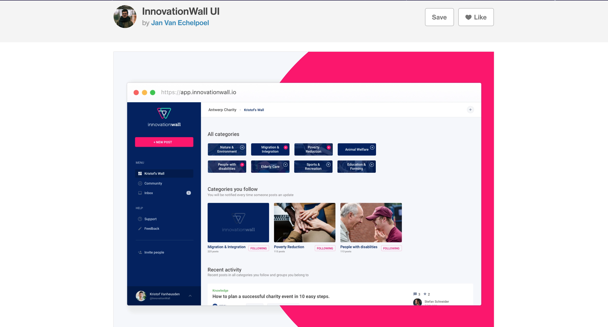

# Image Resizer

~~[ View Live ](##)~~
=================

### Plan
Make an Image resize Tool with Nodejs That can read a single image file or folder and perform resizing action on *ALL images.

#### Must haves 
<ol>
  <li> Ability to resize all images in a folder </li>
  <li> One  page web app containing all operations necessary</li> 
  <li> Needs to be lightening fast = No fansy animations </li>
</ol>

#### Optional
<ol>
  <li> Add an interface the allows a user to use rules on how resizing will happen </li>
  <li> Have a copy of the original images that will allow a user to revert if they mess up </li> 
  <li> Make the interface to look great and self explanatory </li>
</ol>

#### Ideas 
Start by going through Dribbble or Pinterest to get ideas on the designs 

This Design Should do perfectly. 
<i>Full credit on the design goes to _Jan Van Echelpoel_ [https://innovationwall.io/]()</i>

